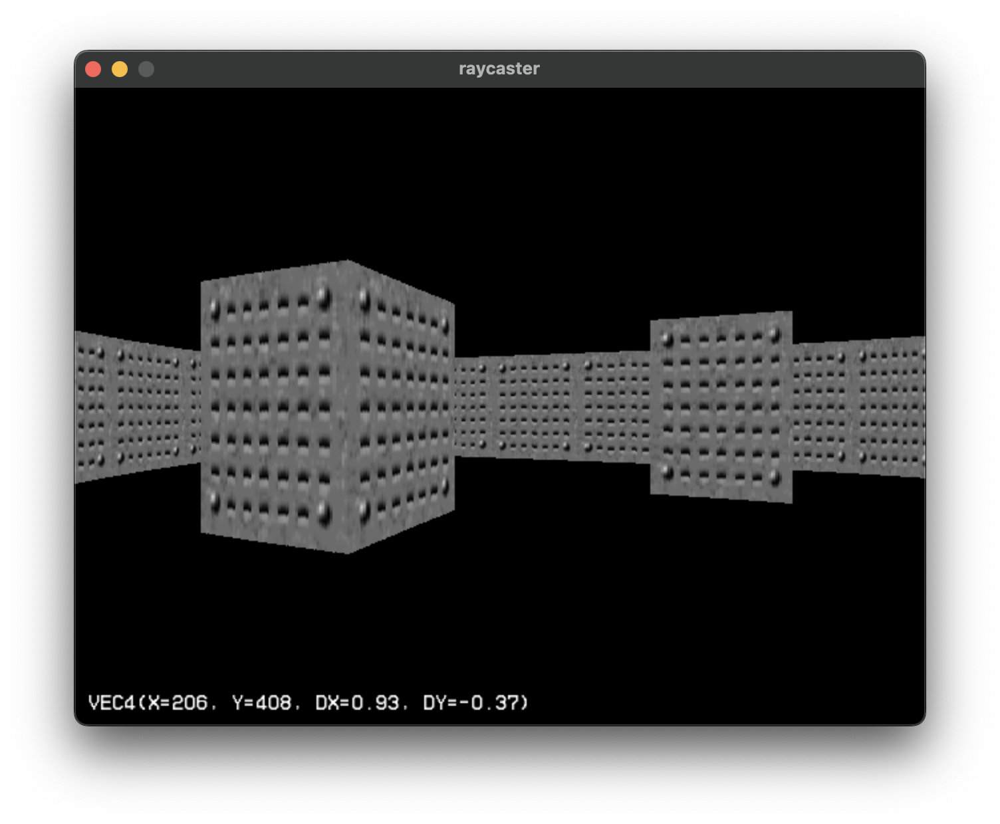

# renderer

A raycasting renderer inspired by _Wolfenstein 3D_

## dependencies

- SDL3
- SDL3_TTF

## usage

```bash
cd renderer
mkdir build
cd build
cmake ..
cmake --build .
cd build
./renderer
```

## controls

Q, E - Strafe left/right
W, S - Move forward/back
A, D - Rotate left/right


